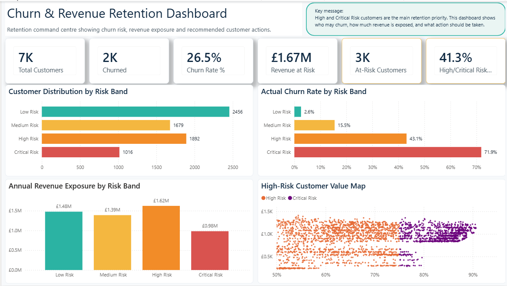
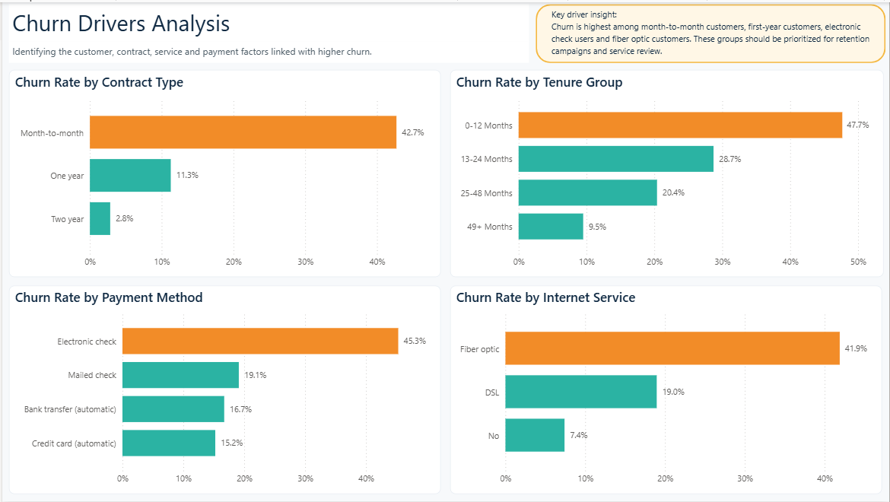
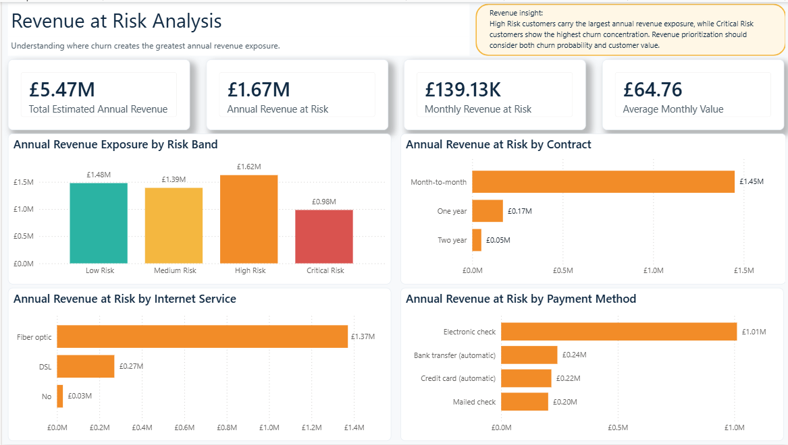
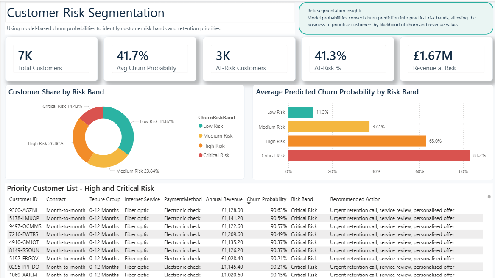
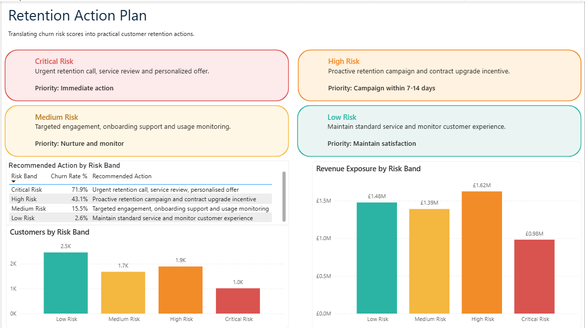

# Customer Churn and Revenue Retention Analysis

## Project Overview

This project analyses customer churn for a subscription-based telecom business and converts churn prediction into practical retention actions.

The objective is not only to identify which customers are likely to churn, but also to understand where churn creates the greatest revenue exposure and how the business should prioritise retention activity.

The project combines Python, SQL Server and Power BI to create an end-to-end analytics workflow covering data cleaning, exploratory analysis, SQL business analysis, machine learning, customer-level risk scoring and dashboard reporting.

---

## Business Problem

Customer churn directly affects recurring revenue, customer lifetime value and commercial growth. A business may know its overall churn rate, but that alone does not explain:

* which customer groups are most likely to churn
* which churn segments create the greatest revenue risk
* which customers should be prioritised first
* what retention action should be taken for each risk group

This project addresses that problem by building a churn and revenue-retention analysis framework that links customer behaviour, revenue exposure and model-based risk scoring.

---

## Tools and Technologies

* Python
* Pandas
* NumPy
* Scikit-learn
* SQL Server
* SQL Server Management Studio
* Power BI
* Git and GitHub

---

## Dataset

The project uses a customer churn dataset containing telecom customer information such as:

* customer demographics
* contract type
* tenure
* internet service type
* payment method
* monthly charges
* total charges
* churn status

Additional analytical features were created, including:

* churn flag
* estimated annual revenue
* average monthly value
* tenure group
* monthly charge band
* predicted churn probability
* churn risk band
* recommended retention action

---

## Project Workflow

### 1. Data Cleaning and Exploratory Analysis

The first notebook cleans the raw dataset and prepares it for analysis.

Key steps included:

* converting `TotalCharges` into numeric format
* handling missing values caused by new customers with zero tenure
* creating a binary churn flag
* creating revenue-focused features
* segmenting customers by tenure and monthly charge bands
* analysing churn by contract, tenure, payment method, internet service and customer value
* identifying combined high-risk customer segments
* creating a retention priority score

Notebook:

```text
notebooks/01_data_cleaning_and_exploration.ipynb
```

Cleaned output:

```text
outputs/telco_customer_churn_cleaned.csv
```

---

### 2. SQL Business Analysis

The cleaned dataset was loaded into SQL Server for business analysis.

The SQL layer includes:

* database and table setup
* overall churn summary
* revenue at risk analysis
* churn by contract type
* churn by tenure group
* churn by payment method
* churn by internet service
* churn by monthly charge band
* combined high-risk segment analysis
* retention priority ranking

SQL scripts:

```text
sql/00_create_database_and_table.sql
sql/01_churn_business_analysis.sql
```

---

### 3. Churn Modelling and Risk Scoring

A machine learning model was built to predict customer churn and convert predictions into risk bands.

Models compared:

* Logistic Regression
* Random Forest
* Tuned Random Forest

The final selected model was the Tuned Random Forest because recall was prioritised for a retention use case. In churn prevention, missing likely churners can be more costly than contacting some customers who may not churn.

Final risk bands:

* Low Risk
* Medium Risk
* High Risk
* Critical Risk

Notebook:

```text
notebooks/02_churn_modelling_and_risk_scoring.ipynb
```

Final output:

```text
outputs/customer_churn_risk_scores.csv
```

---

## Key Results

### Overall Churn and Revenue Risk

* Total customers: 7,043
* Churned customers: 1,869
* Overall churn rate: 26.5%
* Monthly revenue at risk: £139,130.85
* Estimated annual revenue at risk: £1,669,570.20
* Average monthly value of churned customers: £74.44

---

### Churn Drivers

The highest churn rates were found in the following groups:

| Segment                           | Churn Rate |
| --------------------------------- | ---------: |
| Month-to-month contract customers |      42.7% |
| Customers in first 12 months      |      47.7% |
| Electronic check users            |      45.3% |
| Fiber optic customers             |      41.9% |

These segments represent the main behavioural and service-related churn drivers.

---

### Revenue Risk Findings

Revenue risk was not evenly distributed across customer groups.

Key findings:

* Month-to-month customers accounted for approximately £1.45m in estimated annual revenue at risk.
* Fiber optic customers accounted for approximately £1.37m in estimated annual revenue at risk.
* Electronic check customers accounted for approximately £1.01m in estimated annual revenue at risk.
* High Risk customers carried the largest annual revenue exposure among risk bands at approximately £1.62m.

---

### Model Performance

| Model               | Accuracy | Precision | Recall | F1 Score | ROC-AUC |
| ------------------- | -------: | --------: | -----: | -------: | ------: |
| Logistic Regression |    74.3% |     51.0% |  79.7% |    62.2% |   84.6% |
| Random Forest       |    76.5% |     53.8% |  79.9% |    64.3% |   84.6% |
| Tuned Random Forest |    75.5% |     52.5% |  80.9% |    63.7% |   84.6% |

The Tuned Random Forest was selected because it achieved the highest recall, which aligns with the business objective of identifying as many potential churners as possible for proactive retention activity.

---

## Customer Risk Segmentation

The model output was converted into risk bands.

| Risk Band     | Customers | Actual Churn Rate | Annual Revenue Exposure |
| ------------- | --------: | ----------------: | ----------------------: |
| Low Risk      |     2,456 |              2.6% |                  £1.48m |
| Medium Risk   |     1,679 |             15.5% |                  £1.39m |
| High Risk     |     1,892 |             43.1% |                  £1.62m |
| Critical Risk |     1,016 |             71.9% |                  £0.98m |

The risk bands show clear separation between customer groups. Critical Risk customers had the highest actual churn rate, while High Risk customers carried the largest annual revenue exposure.

---

## Power BI Dashboard

A five-page Power BI dashboard was created to turn the analysis into an interactive business reporting tool.

Dashboard file:

```text
reports/Customer_Churn_Revenue_Retention_Dashboard.pbix
```

Dashboard pages:

1. Executive Retention Overview
2. Churn Drivers Analysis
3. Revenue at Risk Analysis
4. Customer Risk Segmentation
5. Retention Action Plan

---

## Dashboard Screenshots

### 1. Executive Retention Overview



### 2. Churn Drivers Analysis



### 3. Revenue at Risk Analysis



### 4. Customer Risk Segmentation



### 5. Retention Action Plan



---

## Retention Recommendations

Based on the analysis, the business should prioritise retention activity as follows:

| Risk Band     | Recommended Action                                           |
| ------------- | ------------------------------------------------------------ |
| Critical Risk | Urgent retention call, service review and personalised offer |
| High Risk     | Proactive retention campaign and contract upgrade incentive  |
| Medium Risk   | Targeted engagement, onboarding support and usage monitoring |
| Low Risk      | Maintain standard service and monitor customer experience    |

The strongest immediate priority is the Critical Risk segment due to its high churn concentration. However, High Risk customers should also receive proactive attention because this group carries the largest annual revenue exposure.

---

## Repository Structure

```text
customer-churn-retention-analysis/
│
├── data/
│   └── telco_customer_churn.csv
│
├── images/
│   ├── 01_executive_retention_overview.png
│   ├── 02_churn_drivers_analysis.png
│   ├── 03_revenue_at_risk.png
│   ├── 04_customer_risk_segmentation.png
│   └── 05_retention_action_plan.png
│
├── notebooks/
│   ├── 01_data_cleaning_and_exploration.ipynb
│   └── 02_churn_modelling_and_risk_scoring.ipynb
│
├── outputs/
│   ├── telco_customer_churn_cleaned.csv
│   └── customer_churn_risk_scores.csv
│
├── reports/
│   └── Customer_Churn_Revenue_Retention_Dashboard.pbix
│
├── sql/
│   ├── 00_create_database_and_table.sql
│   └── 01_churn_business_analysis.sql
│
├── .gitignore
├── LICENSE
└── README.md
```

---

## How to Use This Project

1. Open the notebooks to review the Python cleaning, analysis and modelling workflow.
2. Use the SQL scripts to recreate the SQL Server database and run business analysis queries.
3. Open the Power BI file to explore the dashboard.
4. Use the final risk scoring output for customer-level retention prioritisation.

Main dashboard file:

```text
reports/Customer_Churn_Revenue_Retention_Dashboard.pbix
```

Final modelling output:

```text
outputs/customer_churn_risk_scores.csv
```

---

## Skills Demonstrated

* Data cleaning and feature engineering
* Exploratory data analysis
* SQL business analysis
* Customer churn modelling
* Hyperparameter tuning
* Revenue at risk analysis
* Customer segmentation
* Risk scoring
* Power BI dashboard design
* Business recommendation development
* GitHub project documentation

---

## Project Outcome

This project demonstrates how customer churn analysis can move beyond basic classification and become a practical business retention tool.

The final output allows decision-makers to understand:

* who is likely to churn
* which customer groups are driving churn
* where revenue exposure is highest
* which customers should be prioritised
* what retention action should be taken

The project combines analytical modelling with commercial decision-making, making it suitable for business analyst, data analyst, commercial analyst and customer insight analyst roles.
